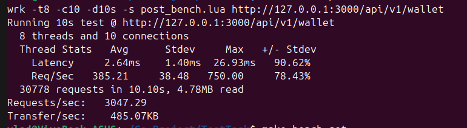
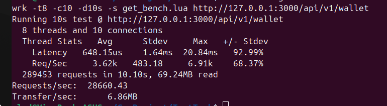

# REST API for finacial operation

<h1>How to run<h1>

```
make compose
```

```
make mig-up
```

<h2> HTTP Endpoints <h2>

```
GET /api/v1/wallet/{wallet-uuid}
```

<b>Response<b>
```
{
    "balance": 1142171.82,
    "time": "2025-05-21T03:22:03.579167Z",
    "type": "deposit",
    "uuid": "a0eebc99-9c0b-4ef8-bb6d-6bb9bd380a11"
}
```


```
POST /api/v1/wallet/
```

<b>Request<b>
```
{
    "balance": 1000.82,
    "type": "deposit",
    "uuid": "a0eebc99-9c0b-4ef8-bb6d-6bb9bd380a11"
}
```

<h4> To run benchmark <h4>

```
make bench-post
```

and

```
make bench-get
```



